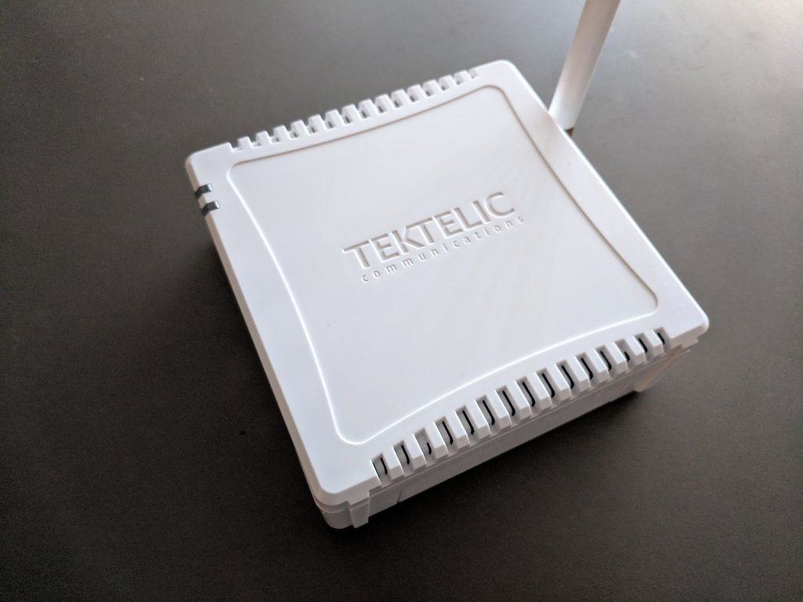
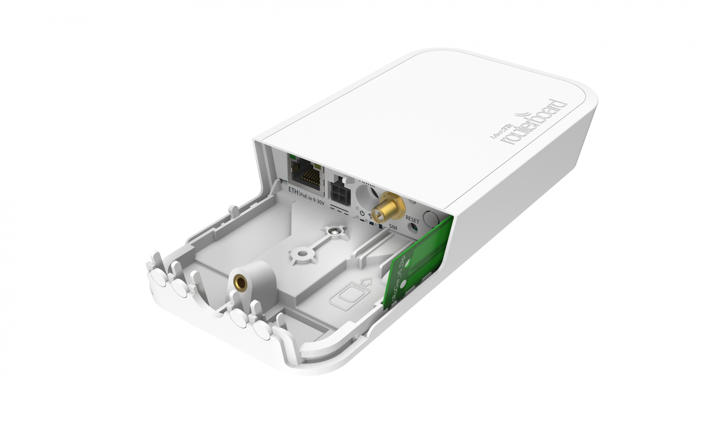
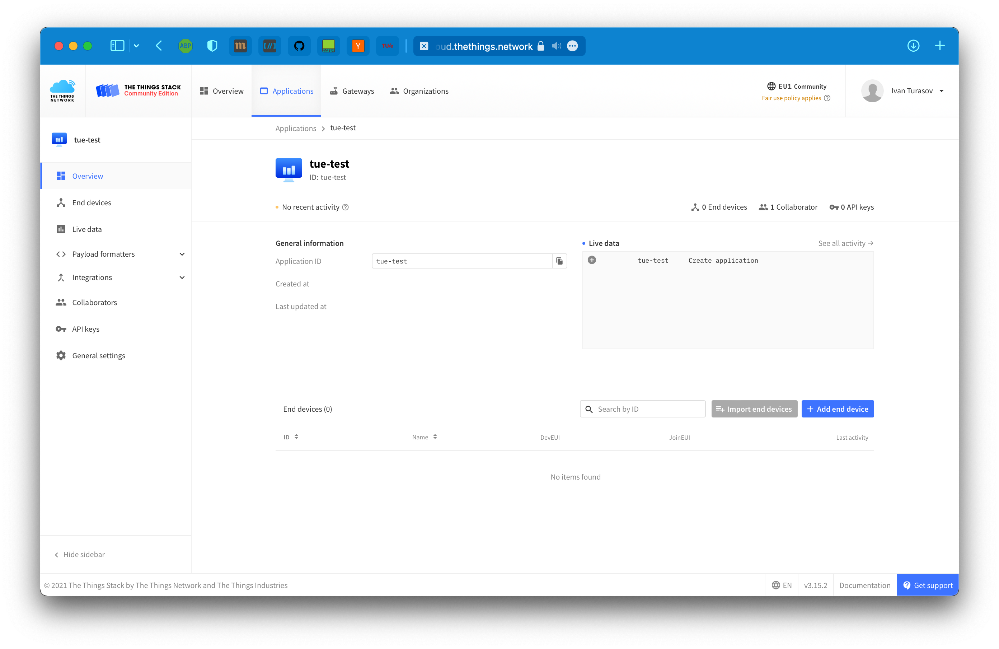
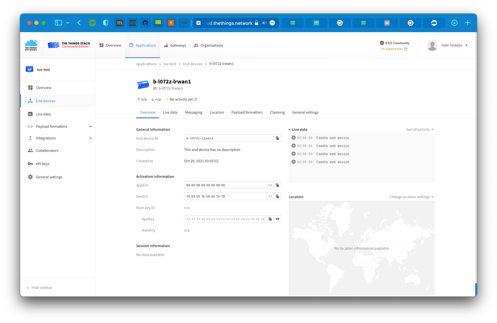
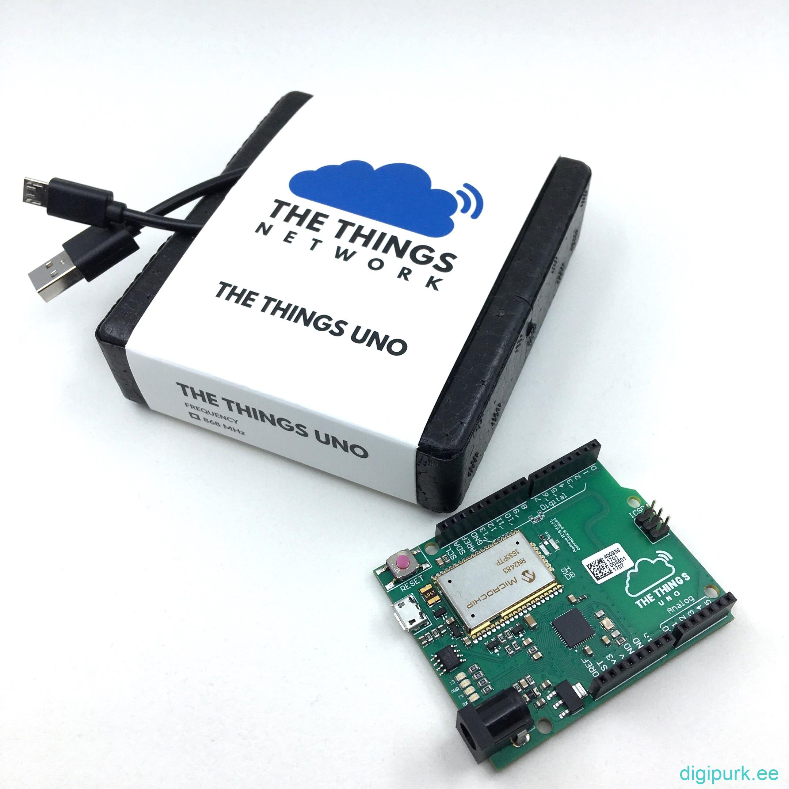
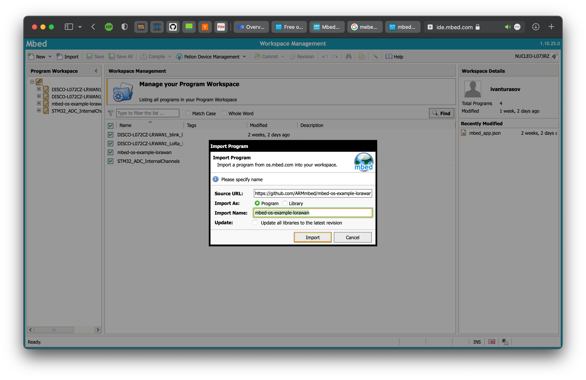
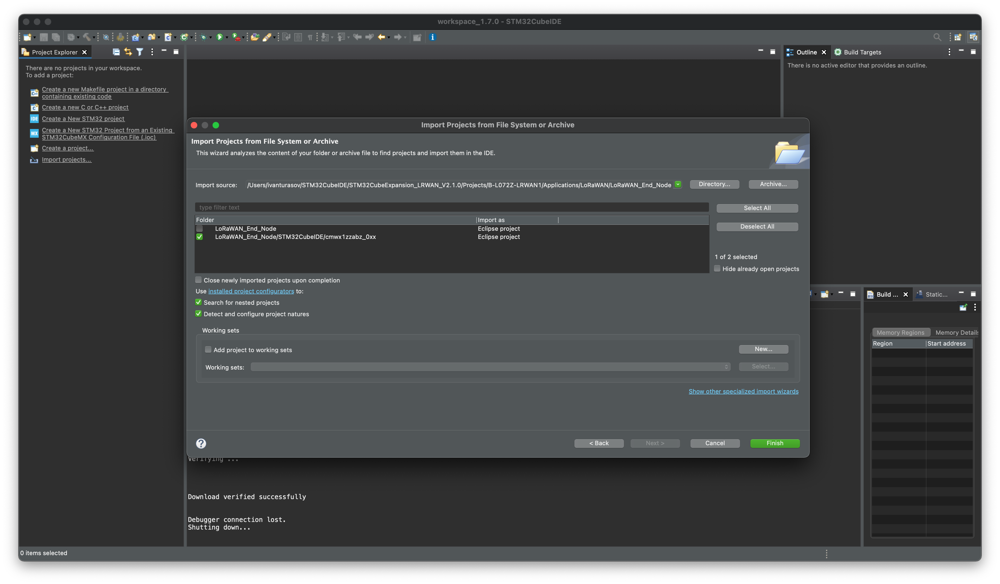
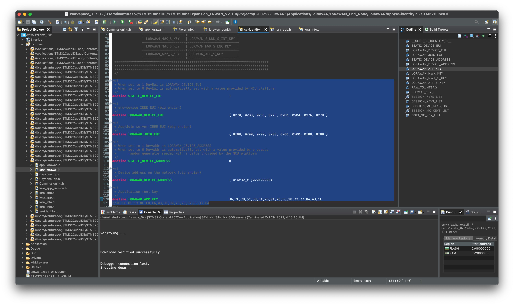

# LoRaWAN experimental network deployment guide
## Eindhoven University of Technology
### 5LIC0 - Networked Embedded Systems
This repository contains guide and resources to quickly deploy an experimental LoRaWAN network. It contains guides for various nodes and gateways, as well as setting up network server locally or in cloud with The Things Stack.

Section 2 - Setting up and deploying gateways - provides a non-exhaustive
list of recommended gateways that can be used to start with LoRaWAN deployment.

Section 5 - Setting up and deploying nodes - provides a non-exhaustive
list of recommended experimental nodes that can be used to start with
LoRaWAN deployment.

# Table of Contents
1. [Setting up Network Server](#network-server)
    * [The Things Stack Community Edition](#tts-community)
    * [The Things Stack On-Premise Local Deployment](#tts-local)

2. [Setting up and deploying gateways](#setting-up-gw)
    * [Nucleo-F746ZG Dev Board with Gateway Expansion Board](#nucleo-gateway)
    * [The Things Indoor Gateway](#ttig)
    * [Tektelic Kona Micro](#kona)
    * [Mikrotik LoRa wAP](#mikrotik)

3. [Creating Application and Adding Integrations](#network-server)

4. [Setting up development environment](#setting-up-env)
    * [STM32CubeIDE](#stm32-ide)
    * [Local Mbed CLI and GNU Arm embedded toolchain](#toolchain)
        - [Preparing and compiling the project for the first time](#first-compile)
    * [Mbed online compiler](#online-compiler)

5. [Setting up and deploying nodes](#setting-up-nodes)
    * [Adding device to The Things Stack](#device-tts)
    * [Firmware - The Things Uno](#thethingsuno)
    * [Firmware - B-L072Z-LRWAN1 STM32 Discovery Kit](#discovery-kit)
    <!-- * [Firmware - Nucleo-L073RZ Dev Board with I-NUCLEO-LRWAN1 LoRa Sensor Expansion Board](#nucleo-node) -->

____________________________________
1. ### Setting up Network Server<a name="network-server">
    A standard used in this setup is [The Things Stack](https://www.thethingsindustries.com/stack/?gclid=CjwKCAjwzaSLBhBJEiwAJSRokmPnIF06ZFI6BN1JdGJh4u5DG9k_ul6xIc6FFRCxZ5r3cKdzENMUuBoCJwkQAvD_BwE) - a LoRaWAN network server implementation by [The Things Network](https://www.thethingsnetwork.org) (and subsequently [The Things Industries](https://www.thethingsindustries.com)). This choice was made due to it being high
    on features (new LoRaWAN standards are implemented very quickly), open-source (github [here](https://github.com/TheThingsNetwork/lorawan-stack))
    and rich in documentation and community support.
    
    It is possible to use the community cloud version, that is deployed globally and operated by TTN, as well as deploy an independent instance of the stack.
    The latter provides more versatility in terms of customization, as well as autonomicity, while community network provides vanilla flow that is extremely easy and fast to start with.

    This guide shows the use of the console (GUI client) for TTN, however there
    is also a CLI client available (ttn-lw-cli). It can provide more versatile
    configuration options for various deployment cases.

    * #### The Things Stack Community Edition<a name="tts-community">
    Using this option boils down to creating an account in the community network server.
    Adding an application, gateways and devices is described in the further parts
    of the manual (see table of contents).

    To create an account, go to https://console.cloud.thethings.network and choose the region (most probably it will be EU)

     

    If you don't yet have an account - register and then log in to the console with your account. If you see the screen below - you are ready to add your applications, gateways and devices, all of which are described in subsequent steps.

     

    * #### The Things Stack On-Premise Local Deployment<a name="tts-local">
    _TODO_
    

____________________________________
2. ### Setting up and deploying gateways<a name="setting-up-gw">
To be able to receive messages from the devices some gateways are required.
If you are using the community network, there is a great chance that
there is already a gateway belonging to someone else deployed around you (
you can check it [on the map](https://www.thethingsnetwork.org/map)).

However, you can still add the gateways that you own.
Below the instructions some gateways, the list is not exhaustive.

Before proceeding, go to The Things Network Console -> Gateways -> Add Gateway and find the gateway server address that your network server is connected with - this is needed for setup of all gateways. In this case the address is
`eu1.cloud.tethings.network`


### Nucleo-F746ZG Dev Board with Gateway Expansion Board<a name="nucleo-gateway">
This gateway comes a part of LoRa STM32 Nucleo pack. A full manual for the pack
can be found [here](./doc/nucleo-pack-config.pdf) - section 6 on page 28 describes the gateway setup.

#### Configuring the board
Connect the gateway as shown in the picture:


It is assumed that the serial monitor also provides 5V power supply to the Nucleo board, and Ethernet is connected to the internet.
Open serial monitor at 115200 baud rate, and press the black button to restart the board.

You will be presented with the information screen with all the details of the current configuration, including the `LORAWAN SERVER` option. For the gateway to
be able to join our stack, we need to provide the gateway server address acquired
in the beginning of this section.


The Nucleo board communicates with the concentrator shield via AT commands (full reference can be found [here](./doc/GW-shield-commands.pdf)).

To change the gateway server address, paste the following command in the terminal:

```bash
# 1700 - uplink and downlink UDP ports of the server
AT+PKTFWD=eu1.cloud.thethings.network,1700,1700
```

If the network you are connecting the gateway to does not have a DHCP server, you can set up an IP address manually as well
```bash
AT+IP=STATIC,<ip>,<netmask>,<gatewayip>
```

Frequency plan can also be changed if needed, with the command
```bash
AT+CH=<Freq>
# Freq = EU868 | US915 | EU433 | CN780 | AU915 | ...
```

If everything set up correctly, you should see the messages saying the uplink and downlink UDPs are connected.


#### Adding the gateway to The Things Network

To add the gateway to your TTN account, navigate to the [console](https://console.cloud.thethings.network), go to gateways tab and select "Add Gateway", as before.

Now, fill in
- Gateway ID - any string ID (e.g. my-nucleo)
- Gateway EUI - this can be found in the serial output of the device. This might be a little bit confusing, because in the gateway output it's called `GATEWAY ID`, but this is the Gateway EUI we need. In this case it's `0080E1FFFF014E4A`
- Name and description can be skipped
- Gateway server - in this example `eu1.cloud.thethings.network`
- Frequency plan - `Europe 863-870 MHz (SF9 for RX2)`
- Enforce duty cycle - recommended, but can be disabled for experimental purposes

After this click `Create gateway`.

If everything was set up correctly, you will see your gateway go online after some time, and some uplink and downlink messages will be seen as well, if there are devices around.

You can also manually add the location of the gateway on the map.


### The Things Indoor Gateway<a name="ttig">


A detailed instruction on how to set up TTIG can be found [here](https://www.thethingsindustries.com/docs/gateways/thethingsindoorgateway/).

### Tektelic Kona Micro<a name="kona">


A robust gateway with great hardware.

A detailed instruction on how to set up Tektelic Kona Micro
can be found [here](https://www.thethingsindustries.com/docs/gateways/tektelickonamicro/)

### MikroTik Routerboard wAP LoRa8 kit<a name="mikrotik">



This is a great gateway that can also serve as a Wi-Fi access point simultaneously.

A detailed instruction on how to set up MikroTik Routerboard wAP LoRa8 kit
can be found [here](https://www.thethingsindustries.com/docs/gateways/mikrotikrouterboard/)
____________________________________
2. ### Creating Application and Adding Integrations<a name="network-server">
To be able to add nodes and manage their data, an application is needed.
To create an application, go to console -> Applications -> Add application.

Simply enter an Application ID and press "Create application".

Now you are ready to add devices.



____________________________________
3. ### Setting up development environment (B-L072Z-LRWAN1 STM32 Discovery Kit)<a name="setting-up-env">

This section is dedicated to configuring different types of development
environment for developing firmware for B-L072Z-LRWAN1 STM32 Discovery Kit.

mbedOS is the recommended platform, as it is more versatile and easy to work with
than LoRaWAN extension modules for STM32CubeIDE. First two sections describe
two ways of working with mbedOS, the last section is dedicated to STM32CubeIDE.

#### Local Mbed CLI and GNU Arm embedded toolchain <a name="toolchain">
mbedOS allows for various ways to create and cross-compile the firmware for
a lot of end devices and development boards. The `B-L072Z-LRWAN1 STM32` board
from the nodes in this manual supports mbedOS.

This variant allows for working wit the code and cross-compiling locally.

More details about installing the Mbed CLI 2 (including Windows), as well as 
dependencies can be found [here](https://os.mbed.com/docs/mbed-os/v6.15/build-tools/mbed-cli-2.html).

Below the installation process:

Prerequisites (for Unix systems)
 - Make sure you have Python 3.6 or higher, and the corresponding development package (i.e. `python3-dev`)
 - Install [CMake](htps://cmake.org/install/)
 - Install [Ninja ](https://github.com/ninja-build/ninja/wiki/Pre-built-Ninja-packages)
 - Install [GNU Arm Embedded Toolchain](https://developer.arm.com/tools-and-software/open-source-software/developer-tools/gnu-toolchain/gnu-rm/downloads)

After the prerequisites are satisfied, create a virtual environment in the root
of this repository for installing python packets to avoid conflicts with the
host packets

```bash
➜ python3 -m venv env_mbed
➜ source ./env_mbed/bin/activate

# To deactivate the virtual environment use
➜ deactivate
```

After activating the virtual environment install the Mbed CLI, and make sure that
`~/.local/bin` is in the path


```bash
➜ python -m pip install mbed-tools

# If ~/.local/bin not in PATH
➜ PATH="$PATH:~/.local/bin"
```
- ##### Preparing and compiling the project for the first time<a name="first-compile">
Navigate to the directory with the project (e.g. `./mbed-os-example-lorawan` in this repository) and prepare the project:

```bash
➜ mbed_tools deploy
Checking out all libraries to revisions specified in .lib files. Resolving any unresolved libraries.
The following library dependencies were fetched: 

Library Name    Repository URL                      Path                                                                     Git Reference
--------------  ----------------------------------  -----------------------------------------------------------------------  ---------------
mbed-os         https://github.com/ARMmbed/mbed-os  /Users/ivanturasov/5lic_repo/repository/mbed-os-example-lorawan/mbed-os  master
```
Now the project is ready for building, refer to project readme in `./mbed-os-example-lorawan/README.md`

#### Mbed online compiler<a name="online-compiler">

Go to https://os.mbed.com/accounts/login/ and create an account.
After logging in, go to `Compiler` in the top right of the page, near profile,
and verify you can see the online IDE.

#### STM32CubeIDE <a name="stm32-ide">
This variant can be used to create firmwares for both `B-L072Z-LRWAN1 STM32`
and `Nucleo-L073RZ Dev Board with I-NUCLEO-LRWAN1`

First download and install the IDE ([link](https://www.st.com/en/development-tools/stm32cubeide.html)). It requires registering a free profile at the ST portal.

Launch the IDE, and note the path to the workspace that you begin in.
After, download the [I-CUBE-LRWAN software expansion](https://www.st.com/en/embedded-software/i-cube-lrwan.html) and move the downloaded files to the workspace
directory for convenience.

At this point, the pre-configuration is complete, further steps are described in
the respective end devices'

____________________________________

4. ### Setting up and deploying nodes<a name="setting-up-nodes">
This part is dedicated to configuring the example firmware for the nodes 
building it and flashing it to the device.
The base for the firmware can be different - B-L072Z-LRWAN1 can run arm
mbedOS and ST firmware, while Nucleo-L073RZ can only be used with ST firmware at
the moment of writing.

#### Adding device to The Things Stack<a name="device-tts">
Go to the console, navigate to the application created in the section above,
and click `Add end device` button.

This step is the same for both nodes described further.

Go to the tab `Manually` and configure the following parameters:

- Frequency plan - select the same, as was selected for the gateway (`Europe 863-870 MHz (SF9 for RX2)`)
- LoRaWAN version - MAC V1.0.3
- Regional Parameters Version - PHY V1.0.3 REV A
- DevEUI - Generate
- AppEUI - Fill with zeros
- AppKey - Generate
- End device ID - any string (e.g. `my-new-device`)

Click `Register end device`.



```
Note - advanced activation options like ABP can be configured here, but this
manual covers only OTAA. For more details explore The Things Network
documentation.
```

#### Firmware - The Things Uno<a name="thethingsuno">



The Things Uno (actually based on Arduino Leonardo) is a perfect device to start
rapid prototyping with LoRaWAN.

Extensive guide on how to start with, configure and flash this board can be found
[here](https://www.thethingsindustries.com/docs/devices/the-things-uno/).
#### Firmware - B-L072Z-LRWAN1 STM32 Discovery Kit<a name="discovery-kit">
- #### mbedOS
    The mbed-os example provided in `./mbed-os-example-lorawan` can be modified
    to add peripherals, LED controls or anything else - for this add code to
    `main.c`.

    - Local

        Navigate to `./mbed-os-example-lorawan` and follow the build
        and flash instructions in the `README.md`.

        Fille the `"lora.device-eui"`, `"lora.application-eui"` and
        `"lora.application-key"` fields in `mbed_app.json` with the DevEUI,
        AppEUI and AppKey generated in the console in the previous step.

        Flash the resulting binary with either `--flash` flag in mbed-tools, or by dragging the .bin file in the USB volume of the
        node connected to the host machine

    - Online

        Go to [mbed-os-example-lorawan](https://os.mbed.com/teams/mbed-os-examples/code/mbed-os-example-lorawan/) page and click `Import into compiler`.

        

        Fille the `"lora.device-eui"`, `"lora.application-eui"` and
        `"lora.application-key"` fields in `mbed_app.json` with the DevEUI,
        AppEUI and AppKey generated in the console in the previous step.

        Compile and download the binary, and put it in the USB volume of the
        node connected to the host machine.

- #### STM32CubeIDE

Open the IDE and go to Import the project, then select `Import Atolli TrueSTUDIO Project`

Select the path where you saved the LoRaWAN extension, and navigate to `STM32CubeIDE/STM32CubeExpansion_LRWAN_V2.1.0/Projects/B-L072Z-LRWAN1/Applications/LoRaWAN/LoRaWAN_End_Node`

Select the project that contains `cmwx1zzabz_0xx` and click Finish.



In the file explorer open the file
`STM32CubeIDE/STM32CubeExpansion_LRWAN_V2.1.0/Projects/B-L072Z-LRWAN1/Applications/LoRaWAN/LoRaWAN_End_Node/LoRaWAN/App/se-identity.h`
and fill in the keys generated when creating the device in the console



Build the firmware with the hammer in the left top corner, and then run it in the device with the play button. After it's flashed, open the serial monitor and verify that the keys are configured correctly and the connection with the server was successful.

The device page in the application should be showing the messages flying from the device.

<!-- #### Firmware - Nucleo-L073RZ Dev Board with I-NUCLEO-LRWAN1 LoRa Sensor Expansion Board<a name="nucleo-node">
[This link](https://os.mbed.com/platforms/ST-Nucleo-L073RZ/) contains description of the board pinout, as well as other specifications and documents.

The I-NUCLEO-LRWAN1 shield is not yet supported by mbedOS, so only the
firmware compiled with STM32CubeIDE can be used.

The flow is pretty much similar to the STM32CubeIDE part of B-L072Z-LRWAN1. -->
____________________________________
