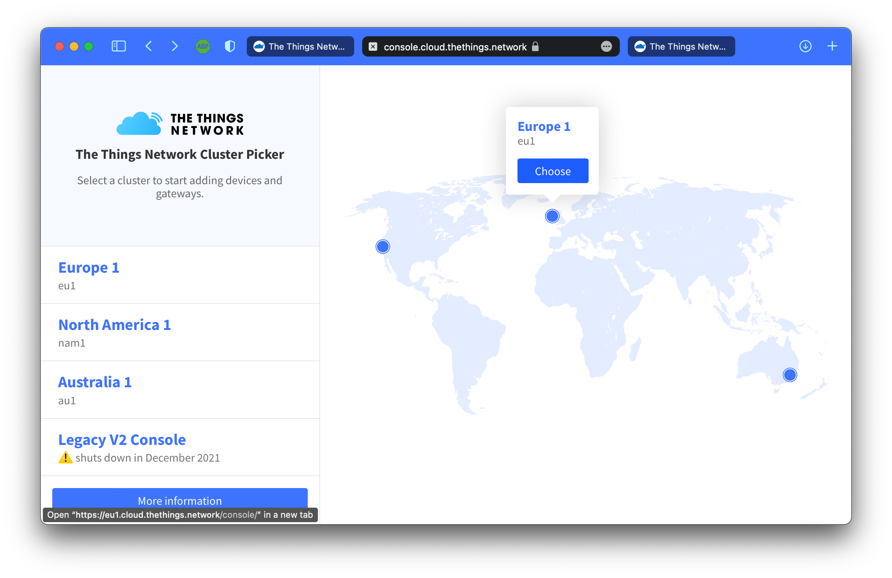
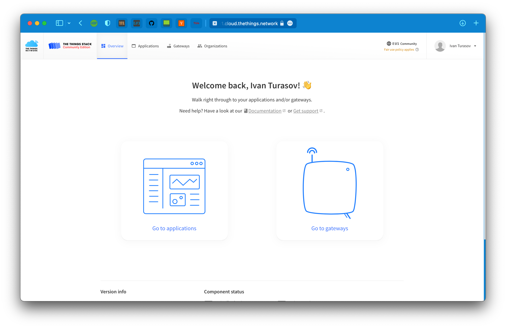
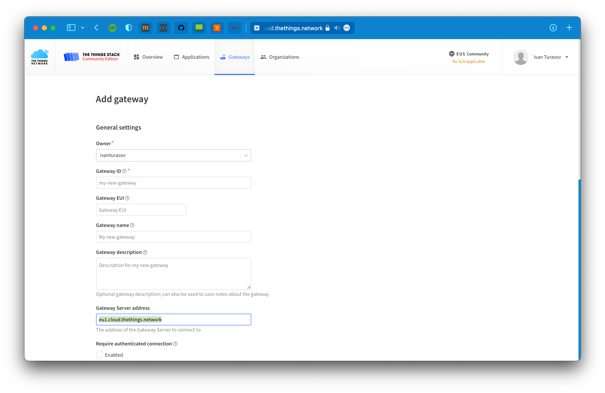
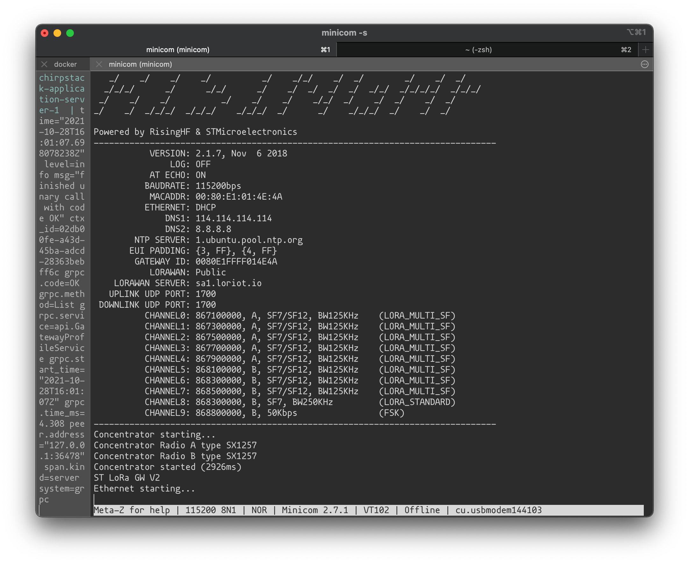
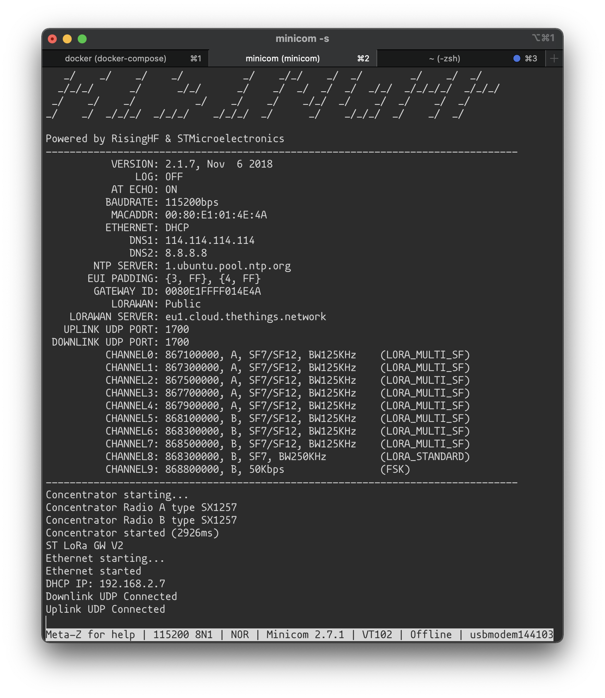
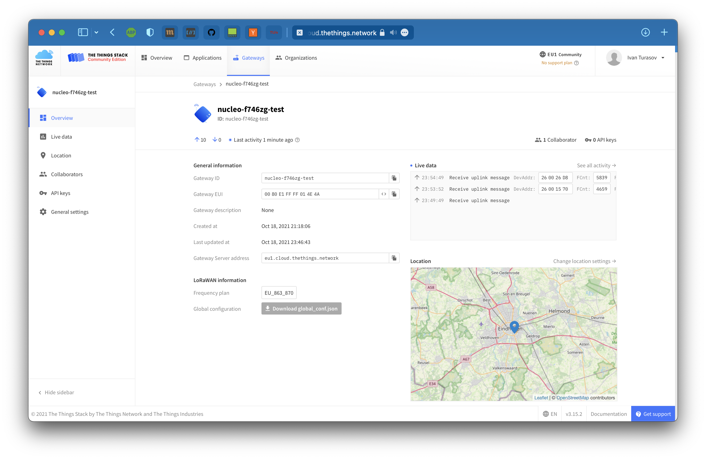
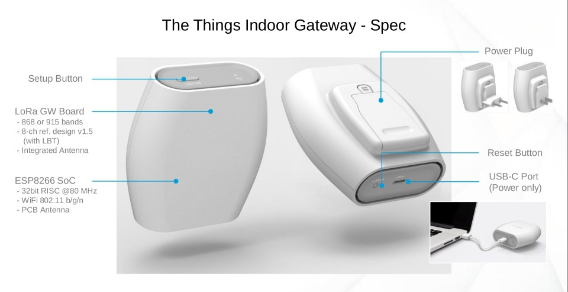

# LoRaWAN experimental network deployment guide
## Eindhoven University of Technology
### 5LIC0 - Networked Embedded Systems
This repository contains guide and resources to quickly deploy an experimental LoRaWAN network. It contains guides for various nodes and gateways, as well as setting up network server locally or in cloud with The Things Stack.

Perform this to load the example project for the nodes prior to continuing with
the manual

```bash
➜ git submodule init
➜ git submodule update
```

# Table of Contents
1. [Setting up Network Server](#network-server)
    * [The Things Stack Community Edition](#tts-community)
    * [The Things Stack On-Premise Local Deployment](#tts-local)

2. [Setting up and deploying gateways](#setting-up-gw)
    * [Nucleo-F746ZG Dev Board with Gateway Expansion Board](#nucleo-gateway)
    * [The Things Indoor Gateway](#ttig)
    * [Tektelic Kona Micro](#kona)
    * [Mikrotik LoRa wAP](#mikrotik)

3. [Creating Application and Adding Integrations](#network-server)

4. [Setting up development environment](#setting-up-env)
    * [STM32CubeIDE](#stm32-ide)
    * [Using Mbed CLI and GNU Arm embedded toolchain](#toolchain)
        - [Preparing and compiling the project for the first time](#first-compile)
    * [Using Mbed online compiler](#online-compiler)

5. [Setting up and deploying nodes](#setting-up-nodes)
    * [B-L072Z-LRWAN1 STM32 Discovery Kit](#discovery-kit)
    * [Nucleo-L073RZ Dev Board with I-NUCLEO-LRWAN1 LoRa Sensor Expansion Board](#nucleo-node)

____________________________________
1. ### Setting up Network Server<a name="network-server">
    A standard used in this setup is [The Things Stack](https://www.thethingsindustries.com/stack/?gclid=CjwKCAjwzaSLBhBJEiwAJSRokmPnIF06ZFI6BN1JdGJh4u5DG9k_ul6xIc6FFRCxZ5r3cKdzENMUuBoCJwkQAvD_BwE) - a LoRaWAN network server implementation by [The Things Network](https://www.thethingsnetwork.org) (and subsequently [The Things Industries](https://www.thethingsindustries.com)). This choice was made due to it being high
    on features (new LoRaWAN standards are implemented very quickly), open-source (github [here](https://github.com/TheThingsNetwork/lorawan-stack))
    and rich in documentation and community support.
    
    It is possible to use the community cloud version, that is deployed globally and operated by TTN, as well as deploy an independent instance of the stack.
    The latter provides more versatility in terms of customization, as well as autonomicity, while community network provides vanilla flow that is extremely easy and fast to start with.
    * #### The Things Stack Community Edition<a name="tts-community">
    Using this option boils down to creating an account in the community network server.
    Adding an application, gateways and devices is described in the further parts
    of the manual (see table of contents).

    To create an account, go to https://console.cloud.thethings.network and choose the region (most probably it will be EU)

     

    If you don't yet have an account - register and then log in to the console with your account. If you see the screen below - you are ready to add your applications, gateways and devices, all of which are described in subsequent steps.

     

    * #### The Things Stack On-Premise Local Deployment<a name="tts-local">
    _TODO_
    

____________________________________
2. ### Setting up and deploying gateways<a name="setting-up-gw">
To be able to receive messages from the devices some gateways are required.
If you are using the community network, there is a great chance that
there is already a gateway belonging to someone else deployed around you (
you can check it [on the map](https://www.thethingsnetwork.org/map)).

However, you can still add the gateways that you own.
Below the instructions some gateways, the list is not exhaustive.

Before proceeding, go to The Things Network Console -> Gateways -> Add Gateway and find the gateway server address that your network server is connected with - this is needed for setup of all gateways. In this case the address is
`eu1.cloud.tethings.network`



* #### Nucleo-F746ZG Dev Board with Gateway Expansion Board<a name="nucleo-gateway">
This gateway comes a part of LoRa STM32 Nucleo pack. A full manual for the pack
can be found [here](./doc/nucleo-pack-config.pdf) - section 6 on page 28 describes the gateway setup.

#### Configuring the board
Connect the gateway as shown in the picture:


It is assumed that the serial monitor also provides 5V power supply to the Nucleo board, and Ethernet is connected to the internet.
Open serial monitor at 115200 baud rate, and press the black button to restart the board.

You will be presented with the information screen with all the details of the current configuration, including the `LORAWAN SERVER` option. For the gateway to
be able to join our stack, we need to provide the gateway server address acquired
in the beginning of this section.



The Nucleo board communicates with the concentrator shield via AT commands (full reference can be found [here](./doc/GW-shield-commands.pdf)).

To change the gateway server address, paste the following command in the terminal:

```bash
# 1700 - uplink and downlink UDP ports of the server
AT+PKTFWD=eu1.cloud.thethings.network,1700,1700
```

If the network you are connecting the gateway to does not have a DHCP server, you can set up an IP address manually as well
```bash
AT+IP=STATIC,<ip>,<netmask>,<gatewayip>
```

Frequency plan can also be changed if needed, with the command
```bash
AT+CH=<Freq>
# Freq = EU868 | US915 | EU433 | CN780 | AU915 | ...
```

If everything set up correctly, you should see the messages saying the uplink and downlink UDPs are connected.



#### Adding the gateway to The Things Network

To add the gateway to your TTN account, navigate to the [console](https://console.cloud.thethings.network), go to gateways tab and select "Add Gateway", as before.

Now, fill in
- Gateway ID - any string ID (e.g. my-nucleo)
- Gateway EUI - this can be found in the serial output of the device. This might be a little bit confusing, because in the gateway output it's called `GATEWAY ID`, but this is the Gateway EUI we need. In this case it's `0080E1FFFF014E4A`
- Name and description can be skipped
- Gateway server - in this example `eu1.cloud.thethings.network`
- Frequency plan - `Europe 863-870 MHz (SF9 for RX2)`
- Enforce duty cycle - recommended, but can be disabled for experimental purposes

After this click `Create gateway`.

If everything was set up correctly, you will see your gateway go online after some time, and some uplink and downlink messages will be seen as well, if there are devices around.

You can also manually add the location of the gateway on the map.



* #### The Things Indoor Gateway<a name="ttig">

A detailed instruction on how to claim TTIG can be found [here](https://www.thethingsindustries.com/docs/gateways/thethingsindoorgateway/).

* #### Tektelic Kona Micro<a name="kona">

* #### Mikrotik LoRa wAP<a name="mikrotik">

____________________________________
2. ### Creating Application and Adding Integrations<a name="network-server">
To be 
____________________________________
3. ### Setting up development environment<a name="setting-up-env">

#### STM32CubeIDE <a name="stm32-ide">
This variant can be used to create firmwares for both `B-L072Z-LRWAN1 STM32`
and `Nucleo-L073RZ Dev Board with I-NUCLEO-LRWAN1`


#### Using Mbed CLI and GNU Arm embedded toolchain <a name="toolchain">
mbedOS allows for various ways to create and cross-compile the firmware for
a lot of end devices and development boards. The `B-L072Z-LRWAN1 STM32` board
from the nodes in this manual supports mbedOS.

This variant allows for working wit the code and cross-compiling locally.

More details about installing the Mbed CLI 2 (including Windows), as well as dependencies can be found [here](https://os.mbed.com/docs/mbed-os/v6.15/build-tools/mbed-cli-2.html).

Below the install
Prerequisites (for Unix systems):
 - Make sure you have Python 3.6 or higher, and the corresponding development package (i.e. `python3-dev`)
 - Install [CMake](htps://cmake.org/install/)
 - Install [Ninja ](https://github.com/ninja-build/ninja/wiki/Pre-built-Ninja-packages)
 - Install [GNU Arm Embedded Toolchain](https://developer.arm.com/tools-and-software/open-source-software/developer-tools/gnu-toolchain/gnu-rm/downloads)

After the prerequisites are satisfied, create a virtual environment in the root
of this repository for installing python packets to avoid conflicts with the
host packets

```bash
➜ python3 -m venv env_mbed
➜ source ./env_mbed/bin/activate

# To deactivate the virtual environment use
➜ deactivate
```

After activating the virtual environment install the Mbed CLI, and make sure that
`~/.local/bin` is in the path


```bash
➜ python -m pip install mbed-tools

# If ~/.local/bin not in PATH
➜ PATH="$PATH:~/.local/bin"
```
- ##### Preparing and compiling the project for the first time<a name="first-compile">
Navigate to the directory with the project (e.g. `./mbed-os-example-lorawan` in this repository) and prepare the project:

```bash
➜ mbed_tools deploy
Checking out all libraries to revisions specified in .lib files. Resolving any unresolved libraries.
The following library dependencies were fetched: 

Library Name    Repository URL                      Path                                                                     Git Reference
--------------  ----------------------------------  -----------------------------------------------------------------------  ---------------
mbed-os         https://github.com/ARMmbed/mbed-os  /Users/ivanturasov/5lic_repo/repository/mbed-os-example-lorawan/mbed-os  master
```
Now the project is ready for building, refer to project readme in `./mbed-os-example-lorawan/README.md`

* #### Using Mbed online compiler<a name="online-compiler">
____________________________________

4. ### Setting up and deploying nodes<a name="setting-up-nodes">
    This part is dedicated to configuring the example firmware for the nodes 
    building it and flashing it to the device.
    The base for the firmware was chosen to be arm mbedOS (other possibilities and motivation for this choice are described in the high-level report).

    * #### B-L072Z-LRWAN1 STM32 Discovery Kit<a name="discovery-kit">
        - 
    * #### Nucleo-L073RZ Dev Board with I-NUCLEO-LRWAN1 LoRa Sensor Expansion Board<a name="nucleo-node">
    [This link](https://os.mbed.com/platforms/ST-Nucleo-L073RZ/) contains description of the board pinout, as well as other specifications and documents.
____________________________________
